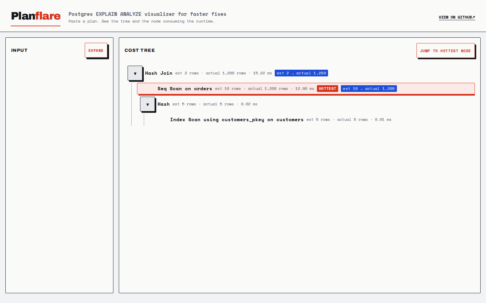

# Planflare

**▶ Live demo: [apps.charliekrug.com/planscope](https://apps.charliekrug.com/planscope/)**

[](https://github.com/ctkrug/planscope/actions/workflows/ci.yml)
[](LICENSE)

**Postgres EXPLAIN ANALYZE visualizer for faster fixes.**

Planflare is a browser-based query plan visualizer for backend developers
debugging slow SQL. Paste PostgreSQL, MySQL, or SQLite EXPLAIN output and it
becomes an interactive cost tree. The operation with the highest self-time is
marked in red, and row estimates that miss actual results by more than 10 times
are flagged in blue.

The Rust parser runs as WebAssembly in the browser. Query plan text, including
any literal filter values it contains, stays on your device.



## What it shows

- **The operation consuming runtime.** Hotspot detection uses self-time, which
  subtracts direct child duration from a node's inclusive total. The root does
  not win simply because it contains every other operation.
- **Planner estimates beside measurements.** Estimated and actual rows appear
  together. A badge calls out differences greater than 10 times.
- **One tree for three database engines.** PostgreSQL text and `FORMAT JSON`,
  MySQL `FORMAT=JSON`, and SQLite `EXPLAIN QUERY PLAN` all map to the same node
  model.
- **Details without the wall of text.** Collapse subtrees, jump to the hottest
  node, and open any row to inspect all parsed cost, timing, loop, and relation
  fields.
- **A useful view after refresh.** The last successful plan and collapsed paths
  persist in local storage until you clear them.

## Use Planflare

Generate a plan in the format for your database, open the
[live visualizer](https://apps.charliekrug.com/planscope/), select the engine,
and paste the output.

PostgreSQL:

```sql
EXPLAIN (ANALYZE, BUFFERS)
SELECT orders.*
FROM orders
JOIN customers ON customers.id = orders.customer_id
WHERE customers.status = 'active';
```

PostgreSQL JSON is also accepted:

```sql
EXPLAIN (ANALYZE, FORMAT JSON)
SELECT * FROM orders WHERE customer_id = 42;
```

MySQL:

```sql
EXPLAIN FORMAT=JSON
SELECT * FROM orders WHERE customer_id = 42;
```

SQLite CLI output can be copied with pipe separators:

```text
3|0|0|SEARCH customers USING INTEGER PRIMARY KEY (rowid=?)
7|0|0|SCAN orders
```

No database connection or account is required. If you do not have a plan at
hand, each engine has a built-in example that follows the same parse and render
path as pasted input.

## Run locally

Prerequisites:

- Rust with the `wasm32-unknown-unknown` target
- `wasm-bindgen-cli` 0.2.126
- Node.js 20 or newer

```sh
rustup target add wasm32-unknown-unknown
cargo install wasm-bindgen-cli --version 0.2.126 --locked
cd web
npm ci
npm run dev
```

The Vite development server builds the Rust parser before it starts. To create
the static portfolio artifact in `site/`:

```sh
bash scripts/build-site.sh
```

All generated asset paths are relative, so the directory can be served from a
subpath without rewriting URLs.

## Test and verify

```sh
# Rust formatting, lint, parser tests, and wasm target
cargo fmt --all -- --check
cargo clippy --all-targets -- -D warnings
cargo test --all
cargo build --release --target wasm32-unknown-unknown -p planscope-parser

# TypeScript checks, UI tests, coverage, and production build
cd web
npm run lint
npm test
npm run test:coverage
npm run build
```

The parser has engine-specific unit tests plus property tests that feed it
arbitrary input. The UI tests cover tree interaction, node inspection, storage
recovery, malformed input, and the real WASM example plans. See
[`docs/ARCHITECTURE.md`](docs/ARCHITECTURE.md) for the data flow and
[`docs/DESIGN.md`](docs/DESIGN.md) for the visual system.

## Stack

- Rust, Serde, `wasm-bindgen`, and property tests for parsing
- TypeScript, Vite, Vitest, and DOM accessibility tests for the interface
- Static HTML, CSS, JavaScript, and WebAssembly for deployment

## License

MIT. See [LICENSE](LICENSE).

More of Charlie's projects: [apps.charliekrug.com](https://apps.charliekrug.com)
